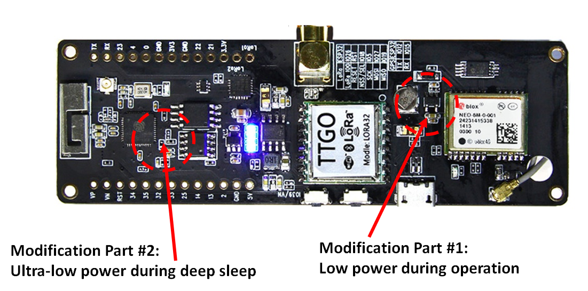
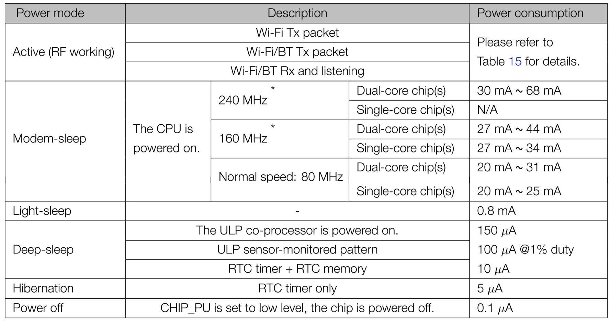
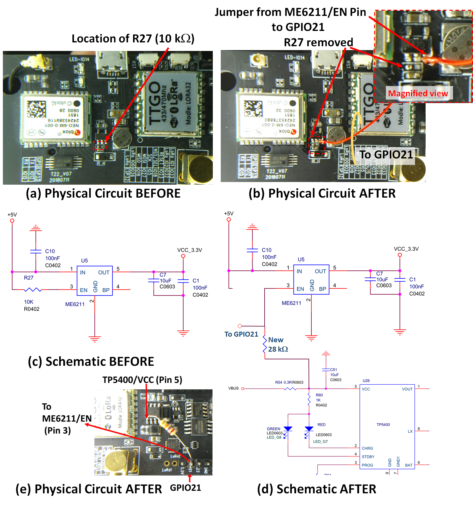
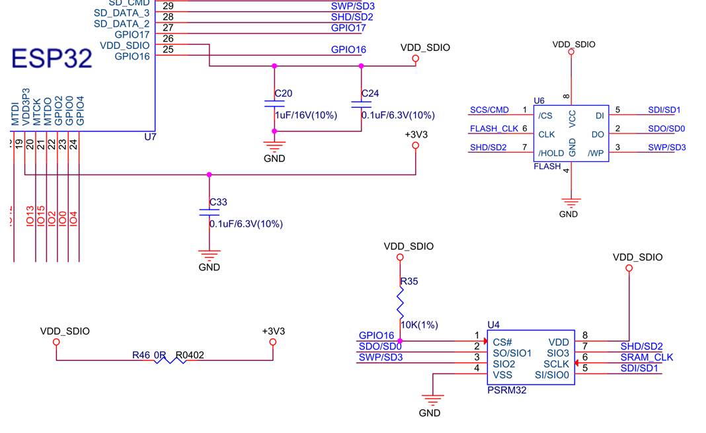
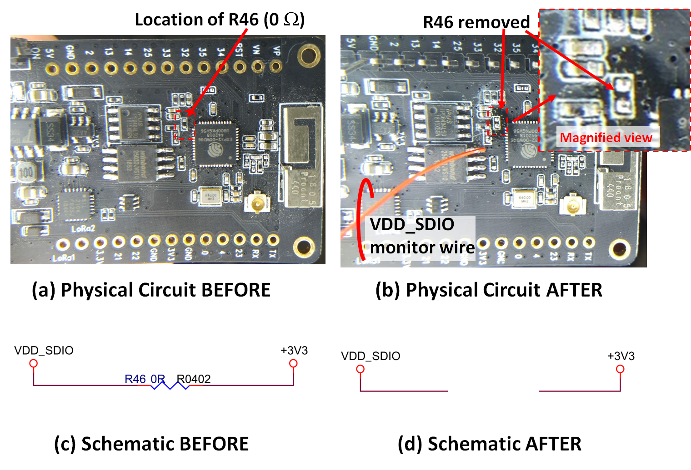

# TTGO Tbeam Ultra Low Power Modification
 
 This page describes two (2) approaches (Part#1 and Part 2) which can significantly decrease the current consumption of the TTGO Tbeam boards based on the ESP32 both in normal operation and when in deep sleep, down to a minimum of  170 &#181;A. The regions on the main board (T22_V2) for the two modifications are shown below in Figure 1.  Each of these proposed changes and their impact are described in more detail below.  These change include:
* Removal of R27 SMD
* Removal of R46 SMD
* Wire link jumper from [ME6211](./resources/ME6211C33M5G_N_C82942.pdf)/EN (Pin 3) to GPIO21 (IO21)
* Resistor connected from [TP5400]( ./resources/Translated_TOPPOWER-Nanjing-Extension-Microelectronics-TP5400_C24154.zh-CN.en.pdf)/VCC (Pin 5) to GPIO21 (IO21)
* Fuse reprogramming using the [espefuse.py](https://github.com/espressif/esptool/wiki/espefuse) tool
 
<b>_PLEASE NOTE:  These modification are for experienced hackers only.  Please do not attempt these changes unless you truely understand what I am proposing, understand how to perform the changes and understand the risks.  As these are hardware and fuse-setting changes, if you make a mistake you can permanently damage your board.  I take no responsibility for damage or problems caused from the information on these pages and as such you need to understand the risks here_</b> 
 
 

   <figcaption >  <I><b>Figure 1: </b></I>  TTGO Tbeam Image modifed from [original image](https://github.com/LilyGO/TTGO-T-Beam/blob/master/images/image1.jpg) showing the regions of the board with the proposed modification detailed below.

 </figcaption >  

 # Background
 The TTGO is an extremely versatile board, providing WiFi, bluetooth, LoRa radio, GPS modules and I/O under the control of an ESP32 processor.  The entire board is powered from a [18650 LiPo which nominally is rated at 2600 mA.hr](https://www.jaycar.com.au/18650-rechargeable-li-ion-battery-2600mah-3-7v/p/SB2308).  However during deep sleep the lowest current that has been [measured is around 10 mA](https://github.com/JoepSchyns/Low_power_TTGO_T-beam), so that the maximum operational time is just over 10 days before some form of recharging is required.  With the changes outlined here to significantly reduce the power of this board, this operational time could be extended to over a year. 
 <b>There are two modifications required to lower the power of the TTGO boards. </b> <I>
 * The first allows complete shutdown of the [NEC 6 GPS](./resources/NEO-6_DataSheet_(GPS.G6-HW-09005).pdf), USB Controller and LoRa board during operation, so that only the ESP32 power consumption dominates.  
 * The second allows shut down off the SPRAM and Flash attached to the [ESP32](./resources/esp32_datasheet_en_ELEC_SPECS.pdf) so that during deep sleep, minimal power is consumed.  With these modifications, a maximum of 170 &#181;A is consumed during deep sleep, considerably less than the nominal [10 mA reported](https://github.com/JoepSchyns/Low_power_TTGO_T-beam),</I> 
 

Deep sleep modes are detailed in the [espressif page](https://docs.espressif.com/projects/esp-idf/en/latest/api-reference/system/sleep_modes.html) which describe how to shut down the ESP 32 into low power mode with all but the RTC operational.  The RTC needs to be active for the processor to wake on a timed interrupt.  The [ESP32 Electrical datasheet](./resources/esp32_datasheet_en_ELEC_SPECS.pdf) indicates the power consumption in the various modes as shown in the table below:
 
 
 

  
<figcaption ><I><b>Table  1: </b></I>Power Consumption of the ESP32 processor.  This table was extracted from the Espressif Systems ESP32 Datasheet V3.3 where it was originally designed "Table 6: Power Consumption by Power Modes" on page 21 of that document.   

 </figcaption >  

## Part #1: Low power during operation (GPS/USB/LoRa Off)

The [ME6211](./resources/ME6211C33M5G_N_C82942.pdf) is a High Speed LDO Regulator and the [TTGO schematic](t22_gps_v07.pdf) includes 2 of these, namely:
* one (U8) to generate a 3.3V that powers the ESP32 and attached memory and 
* one (U5) that generates 3.3V (labelled <b>VCC_3.3V</b>) to power the GPS, USB I/O controller and LoRa board.   

Both these ME6211 regulators contain an enable pin that is pulled high to keep the regulators on after power up.   During a regular boot sequence, the GPS is on and looks for satellites.  This typically draws 180&plusmn;10 mA and lock can take around 2 minutes.  After lock the current consumption is still around 100mA.  While the GPS can be shut down in software, it is difficult to lower the current consumption much less than 90 mA during regular operation.  
In this <b>first approach to lowering the power consumption </b> the enable pin of IC U5 (the  ME6211 that generates  VCC_3.3V) is connected to GPIO21 to allow the power supplied to the GPS/LoRa/USB controller to be placed under software control.  Once done issuing the command <code>digitalWrite(21, LOW) </code> in the .ino file just before shuting down the ESP32 using <code>esp_sleep_enable_timer_wakeup() </code> shuts down GPS/LoRA/USB-Controller, allowing the entire TTGO to enter an ultra-low power state.  This provides much greater flexibility when determining which devices should be powered up and when.
   

The physical layout of the TTGO Tbeam T22_V22 PCB is shown in Figure 2a with the 10 k&Omega; resistor R27 identified next to the [ME6211](./resources/ME6211C33M5G_N_C82942.pdf) SMD. Without adding additional drivers (FETs or other) it is essential to remove the R27 (10 k&Omega;) resistor as we need to control the [ME6211](./resources/ME6211C33M5G_N_C82942.pdf) by driving it's enable pin (pin 3) low using  <code>digitalWrite(21, LOW) </code> _while the ESP32 is in deep sleep_.  As the ESP32 cannot continue to sink current while in deep sleep, leaving the R27 in place will force the [ME6211](./resources/ME6211C33M5G_N_C82942.pdf) enable (pin 3) back into a high state, turning back on the GPS/LoRA/USB-Controller significantly the power consumption (see table #2 below). To remove this surface mount resistor I suggest using a small amount on regular lead-tin solder with a flux resin to allow even flow across the small component.  I performed this task with a regular electronics style 
[soldering iron]( https://www.youtube.com/watch?v=8JM4oCpWnjU ), but it required a magnifying lens with a good light during the process.  After R27 is removed, a small piece of solid core [Kynar wire]( https://www.jaycar.com.au/red-wire-wrap-wire-on-spool/p/WW4344 ) (sometimes called wire-wrap wire) was used to connect from ME6211 Pin 3 to GPIO21 on the header connector.  Once used, GPIO21 should not be used for another other task.  The PCB after R27 removal and the addition of the wire (red) is shown in Figure 2b.  The corresponding circuit before and after the PCB modification is shown in Figure 2c and 2d, respectively.  Note that in Figure 2b I have also disconnected the GPS antenna as it was found that this add at additional ~7 mA (see table #2).  If not using the antenna, best to just disconnect to ensure maximum battery life. 

<b>BUT WAIT</b>: Having removed R27 the GPS/LoRA/USB-Controller is entirely under software control.  <b>What happens when we go to upload updated fireware to the TTGO via USB connected PC ? </b>  With the CP2104 USB-Controller off, the USB connected PC never sees the TTGO board and it can never be reprogrammed (effectively bricked).  The solution is to reconnect a resistor (value anywhere from 10-100 k&Omega;) from [ME6211](./resources/ME6211C33M5G_N_C82942.pdf)/EN (Pin 3) to [TP5400]( ./resources/Translated_TOPPOWER-Nanjing-Extension-Microelectronics-TP5400_C24154.zh-CN.en.pdf)/VCC (Pin 5), the latter pin being connected to the USB 5V supply (VBUS) via a 0.3 &Omega; (R54). This physical change is shown in Figure 2e, where a 27 k&Omega; resistor was used.  In doing so the [ME6211](./resources/ME6211C33M5G_N_C82942.pdf)/EN (Pin 3) is now HIGH whenever the USB cable is connected, overriding the software defined state and the USB port is valid when programming the TTGO. Figure 2d shows the jumper used to connect to the [ME6211](./resources/ME6211C33M5G_N_C82942.pdf)/EN (Pin 3) (actually connected now to GPIO21).   

  <figcaption > <I><b>Figure 2: </b></I>Physical layout of the TTGO Tbeam T22_V22 PCB showing (a) before and (b) after modification of the circuit to remove resistors R27 and add a jumper from Pin 3 of ME6211 (EN) to IO21.  This circuit schematic (c) before and (d) after modification is also shown, (e) addition of resistor from 
[TP5400]( ./resources/Translated_TOPPOWER-Nanjing-Extension-Microelectronics-TP5400_C24154.zh-CN.en.pdf)/VCC (Pin 5) to ME6211/EN (Pin 3) (which is also GPIO21), a change required to keep the USB Controller powered when uploading new firmware. 

</figcaption >  

With this change, by default the GPS/LoRa/USB are off unless the USB cable is plugged in.      If you want to use the GPS/LoRa/USB in normal operation, include the following in the <coe>setup()</code> routine 
<code> pinMode(21, OUTPUT);</code>  
<code> digitalWrite(21, HIGH);</code>

If you intend to force <code> digitalWrite(21, LOW) </code>  to shutdown power to the GPS/LoRa/USB and achieve low power during ESP32 operation you should see the later section [Update: Using the Push button to enter (all ON) firmware programming mode](#update:-using-the-push-button-to-enter-(all-on)-firmware-programming-mode). <b> If the worst happens</b> and you force <code> digitalWrite(21, LOW) </code> and the code you uploaded keeps <code>GPIO21=LOW </code> then you will not be able to program the TTGO and it is effectively "bricked".  However the simple solution is to remove the ME6211/EN (Pin 5) link to GPIO21 and tie this pin high (3.3V or 5V) via a 10 k&Omega; resistor.  This will re-enable the USB controller and you can upload a modified version of the firmware.

## Part #2: Ultra Low power during deep sleep (SPRAM and Flash Off)

During extensive software testing, no conditions could be found to lower the power below 2.2mA in deep sleep.  It turns out the main schematics for the TTGO Tbeam is very similar to that used for the [ESP32 wroom-32](./resources/esp32-wroom-32_datasheet_en_with_SCHEMATICS.pdf) a generic Wi-Fi+BT+BLE MCU module.  From those schmatics, it appears that the external SPRAM and Flash could be shut down by powering both via <b>VDD_SDIO</b> which is a voltage generated through the ESP32 itself (it contains an internal LDO regulator).  However, on the [TTGO Tbeam](https://github.com/LilyGO/TTGO-T-Beam) board the <b>VDD_SDIO is directly connected to 3.3V</b>.  This 3.3V is the main battery supplied voltage, which is always on even during sleep.  As stated in
 [Section 2.3 Power Scheme of the ESP32 datasheet](./resources/esp32_datasheet_en_ELEC_SPECS.pdf)    

><b>VDD3P3_RTC is also the input power supply for RTC and CPU. </b>
><b>VDD3P3_CPU is also the input power supply for CPU.</b>
><b> When VDD_SDIO is connected to the same PCB net together with VDD3P3_RTC, the internal LDO is disabled automatically.  </b> 

Hence connecting VDD_SDIO directly connected to the main 3.3V supply (which supplies VDD3P3_RTC and VDD3P3_CPU) over-rides (bypasses) the internally generated VDD_SDIO voltage (set to 3.3V), so that external SPRAM and Flash (and the associated resistor R35, see [schematic](t22_gps_v07.pdf)) are all drawing current during deep sleep.  However this connection from VDD_SDIO to 3.3V is done through  R46 (a 0&Omega; resistor) so I investigated removing the resistor to determine the possible reduction in current during deep sleep. 

  <figcaption > <I><b>Figure 3: </b></I> Relevant components connected to VDD_SDIO on the TTGO Tbeam T22_V22 circuit schematic.  Not shown in the link the shorts VDD_SDIO to 3.3V on the board through R46 ( a 0&Omega; resistor).  

Using the same approach as described in Figure 2, a [standard soldering iron with a small amount of tin-lead solder with a resin flux](https://www.youtube.com/watch?v=8JM4oCpWnjU) was used to remove R46.  The physical layout of the board is shown in Figure 4a before and 4b after removing of the resistor.  In this image I have also added a small wire to VDD_SDIO to monitor what happens during deep sleep.  Sure enough , when the code enters a deep sleep using <code> esp_deep_sleep_start(); </code> the voltage VDD_SDIO drops to around 250mV, and jumps up to 3.3 V when the board exits from sleep mode.  The relevant section of the [circuit schematic](t22_gps_v07.pdf) have been extracted and shown in Figure 4c and 4d, before and after the modification, respectively.

  <figcaption > <I><b>Figure 4: </b></I>Relevant components connected to VDD_SDIO on the TTGO Tbeam T22_V22 circuit schematic.  Not shown in the link the shorts VDD_SDIO to 3.3V on the board through R46 ( a 0&Omega; resistor).

</figcaption >  

<b>_ISSUES to NOTE_</b>:  When the above changes were made the following erorr would consistently appear during firmware upload using the arduino IDE:
>Configuring flash size... 
>Warning: Could not auto-detect Flash size (FlashID=0xffffff, SizeID=0xff), defaulting to 4MB 
>Compressed 8192 bytes to 47... 
> 
>A fatal error occurred: Timed out waiting for packet content 
>A fatal error occurred: Timed out waiting for packet content 

This error went away when I reconnected VDD_SDIO to 3.3V on the board suggesting the Flash  was off during programming.  Sure enough, a voltage check of VDD_SDIO indicated that it pulsed off as soon as firmware upload started.  The [ESP32 wiki on boot-mode-seelction](https://github.com/espressif/esptool/wiki/ESP32-Boot-Mode-Selection) indicated   
>"If [Ed. MTDI] driven High, flash voltage (VDD_SDIO) is 1.8V not default 3.3V. Has internal pull-down, so unconnected = Low = 3.3V. May prevent flashing and/or booting if 3.3V flash is used and this pin is pulled high, causing the flash to brownout. See the ESP32 datasheet for more details."

The TTGO [schematic](t22_gps_v07.pdf) was confusing, indicating MTDI is pulled high via R19 to 3.3V, but that either R19 was 10 k&Omega;  OR Non-Connected (NC).  A quick check of the TTGO Tbeam T22_V07 board indicated R19 was NC.

Given I wanted to minimize any further hardware changes, I investigated a software/firmware fix by setting of the ESP32 fuses through the use of the [espefuse.py
](https://github.com/espressif/esptool/wiki/espefuse) tool.  After installing this tool I determined the ESP32 initial fuse data by running (from the terminal/command line) 
 <code> espefuse --port COM37 summary</code> (note my port was COM37, your may be different)

The default fuse settings are [here](./resources/ESP32DefaultFuseState.txt) but those relevant to the VDD_SDIO setting are:
>Config fuses:
>XPD_SDIO_FORCE         Ignore MTDI pin (GPIO12) for VDD_SDIO on reset    = 0 R/W (0x0) 
>XPD_SDIO_REG           If XPD_SDIO_FORCE, enable VDD_SDIO reg on reset   = 0 R/W (0x0) 
>XPD_SDIO_TIEH          If XPD_SDIO_FORCE & XPD_SDIO_REG, 1=3.3V 0=1.8V   = 0 R/W (0x0) 
>. 
>. 
>Flash voltage (VDD_SDIO) determined by GPIO12 on reset (High for 1.8V, Low/NC for 3.3V). 

As expected, given that GPIO12 was not connected, the default state during restart was VDD_SDIO=1.8V which explained the FLASH brownout that was ocuring during fireware upload.  This could be fixed by running the command  
<code> espefuse --port COM36 set_flash_voltage 3.3V</code> (note my port was COM37, your may be different)

After which, the resulting fused states are given [here](./resources/ESP32ModifiedFuseState.txt), those relevant to VDD_SDIO being:
>Config fuses:
>XPD_SDIO_FORCE         Ignore MTDI pin (GPIO12) for VDD_SDIO on reset    = 1 R/W (0x1) 
>XPD_SDIO_REG           If XPD_SDIO_FORCE, enable VDD_SDIO reg on reset   = 1 R/W (0x1) 
>XPD_SDIO_TIEH          If XPD_SDIO_FORCE & XPD_SDIO_REG, 1=3.3V 0=1.8V   = 1 R/W (0x1) 
>. 
>. 
>Flash voltage (VDD_SDIO) set to 3.3V by efuse. 

After this change, firmware upload proceeded without issue.

### CURRENT DRAW MEASUREMENTS

Using combinations of a new board, a board with no GPS antenna and the same TTGO in various states of modification (Part #1 and Part #2 above), a combination of tests were performed by running the attached <code>[TTGO_PowerEval.ino](TTGO_PowerEval.ino)</code>.  The code shut down or turned on various components on the board while the DC current was measured, at 10 second intervals.  The results of the testing is shown in Table #2 below where the delay indicates the delay that has passed and the subsequent code/functional-description performed is indicated in column 2 and 3 below.

Delay after start	|	Description	|	code	|	As New	|	As New, No GPS antenna	|	R27 removed, with GPS Antenna	|	R46 removed, with GPS Antenna	|	R27 & R46 removed, with GPS Antenna	|	No GPS antenna, R27 & R46 removed	|
-------------	|	-------------	|	-------------	|	-------------	|	-------------	|	-------------	|	-------------	|	-------------	|	-------------	|
-------------	|	-------------	|	-------------	|	unit (mA)	|	unit (mA)	|	unit (mA)	|	unit (mA)	|	unit (mA)	|	unit (mA)	|
0	|	START	|	<code></code>	|	192	|	182	|	193.5	|	192	|	193	|	**181.5**	|
10	|	GPS OFF	|	<code>ShutDownGPS() </code>	|	92.7	|	86.4	|	92.8	|	92.7	|	92.1	|	**84.9**	|
20	|	WIFI OFF	|	<code>WiFi.mode(WIFI_OFF)</code>	|	92.7	|	86.4	|	92.8	|	92.7	|	92.1	|	84.9	|
30	|	BLUETOOTH OFF	|	<code>btStop()</code>	|	92.7	|	86.5	|	92.8	|	92.7	|	92.1	|	84.9	|
40	|	LORA OFF	|	<code>LoRa.sleep()</code>	|	89.4	|	83.2	|	89.5	|	89.4	|	88.9	|	81.7	|
50	|	ME6211/EN off	|	<code>digitalWrite(ME6211_EN, LOW)</code>	|	78.1	|	71.8	|	73.5	|	78.1	|	73.1	|	76.3	|
60	|	ME6211/EN on	|	<code>digitalWrite(ME6211_EN, HIGH)</code>	|	89.2	|	82.9	|	89.2	|	89.1	|	88.6	|	81.4	|
70	|	LED ON	|	<code>digitalWrite(BUILTIN_LED, HIGH)</code>	|	90.3	|	84.1	|	90.4	|	90.3	|	89.7	|	82.6	|
80	|	LED OFF	|	<code>digitalWrite(BUILTIN_LED, LOW)</code>	|	89.2	|	82.9	|	89.3	|	89.1	|	88.6	|	82.6	|
90	|	config ESP sleep interrupt	|	<code>esp_sleep_enable_timer_wakeup()</code>	|	89.2	|	82.9	|	89.3	|	89.2	|	88.6	|	81.5	|
100	|	config RTC	|	<code>esp_deep_sleep_pd_config(()</code>	|	89.2	|	82.9	|	89.3	|	89.1	|	88.6	|	81.4	|
110	|	enter DEEP sleep	|	<code>esp_deep_sleep_start()</code>	|	**19.25**	|	**12.88**	|	**2.25**	|	**17.2**	|	**0.17**	|	**0.17**	|
 

<figcaption ><I><b>Table  2: </b></I>Measured Current Consumption of the TTGO board at various stages of modification.  Lowest current values achieved at the last entry as the ESP 32 enters deeo sleep.  The last column indicates that with removal of the GPS antenna the current during operation drops by around 7.2mA (11.5 mA when the GPS is active,  but it is not sensible to operate the GSP without the antenna.</figcaption >   
 

The interesting observations from these tests are:
* Shuttign down the GPS immediately in the <code>setup()</code> routine is essential to prevent high current draw after wake up or restart
* Removing the GPS antenna can lower the base current consumption by about 7.2 mA, so that a minimum current of 12.88 mA during deep sleep could be achieved.  This current consumption is consistent with other measurements of [10mA consumption](https://github.com/JoepSchyns/Low_power_TTGO_T-beam)
* Removal of R27 and jumpering to GPIO21 which allowed shutdown of the GPS/LoRa/USB controller during deep sleep allows the current during deep sleep to fall to 2.25mA
* Most of this 2.25mA current during deep sleep came from Flash/PSRAM consumption.  Removal of R46 and fuse-reprogramming to set VDD_SDIO=3.3V allowed deep sleep current consumption to drop to 170 &#181;A
* Antenna removal in addition to R27 &R46 removal (last column) allowed current consumption during operation to be reduced by 7.2 mA
* best configuration appears to be 73.1 mA during operation from <code> digitalWrite(ME6211_EN, LOW)</code> with the GPS anyenna attached, and R27 & R46 removed to allow 0.17 mA during deep sleep

I note that when the entire power to the board is turned off via switch <b>2JP1</b> in the [schematic](t22_gps_v07.pdf), the current drawn is only 70 &#181;A.  A voltage divider made from R42 and R43 loads the LiPo battery with 200K&Omega; accounting to 18.5 &#181;A of this current, so that around 51 &#181;A is consumed by the [TP5400, a 1A lithium battery and 5V / 1A boost control chip]( ./resources/Translated_TOPPOWER-Nanjing-Extension-Microelectronics-TP5400_C24154.zh-CN.en.pdf) used to convert the [18650 LiPo battery](https://www.jaycar.com.au/18650-rechargeable-li-ion-battery-2600mah-3-7v/p/SB2308) from 3.7 V to 5 V.  From the datasheet, the <b> maximum input supply current</b> for this device is 100  &#181;A so the measured value of 51 &#181;A is reasonable. Assuming the same current is consumed when the main power switch <b>2JP1</b> is on, then given the measured total of 170  &#181;A when the ESP32 is in deep sleep mode, I can assume that 100  &#181;A is associated with the ESP32 and 70  &#181;A is associated with R42,R43 and the TP5400 power control chip.  Reviewing the power listed in Table #1 above from the Espressif Systems ESP32 Datasheet V3.3, this measured value of  100  &#181;A is expected from the ESP32 when in deep sleep but with the ULP enabled  (which it is as the processor is this work is arranged to wake on a timed interrupt with ULP and RTC).  Hence I believe there is not much more that can be squeezed out of the circuit to minimize the current unless an external interrupt is used.  Even if we shut down the ULP, the current consumption is dominated by the 70 &#181;A from R42,R43 and the TP5400, power control chip, so that no more than a x0.6 reduction in total current could be achieved.  Given I have dropped the current from an as-new (no GPS antenna) deep sleep current of 12.88 mA to 0.17 mA (a factor of 75) a reduction of x0.6 is hardly worth the effort for further circuit modifications.  If a software solution could be found to further lower the current, I would be interested to see the code.

## Update: Using the Push button to enter (all ON) firmware programming mode
As an alternative mode of operating, you can sense the unused push buton connected to <b>SENSOR_VN</b> to enter programming mode.  See the firmware [TTGO_LowPowerSwitchOverRide.ino](TTGO_LowPowerSwitchOverRide.ino). As written the code initially senses the state of the SENSOR_VN input (GPIO39).  If this is in the high state (default), the [code](TTGO_LowPowerSwitchOverRide.ino) immediately shuts off power to the GPS, LoRa and USB controller (ME6211/EN=GPIO21=LOW) and enters deep sleep.  When the board awakes it: 
1) checks the SENSOR_VN input, and if held on (pushed), applies power to the GPS, LoRa and USB controller (ME6211/EN=GPIO21=HIGH) and the code enters the loop() routine.  It never re-enters deep sleep, staying in this state untill the board is reset or the board is reprogrammed via the serial USB
2) checks if the board has awoken due to  the timer using ESP_SLEEP_WAKEUP_TIMER.  If this is the case, it runs <code>  MyInterruptRoutine() </code>, then returns and re-enters deep-sleep. 

Current consumption was measured to be 0.18 mA in deep sleep, 57.2-58.1 mA when the board wakes up from deep sleep (with GPS, LoRa and USB controller off, ME6211/EN=GPIO21=LOW) and 189-209 mA when SENSOR_VN input is held low during a wake up event (when  GPS, LoRa and USB controller are all on, ME6211/EN=GPIO21=HIGH).  This mode of operation if alot more flexible as it does not impact reprogramming and allows the board to stay in the lowest power state until the required device (GPD, LoRa or USB) is required.   The next step is to lower the clock speed reduce power, by [enabling dynamic frequency scaling](https://docs.espressif.com/projects/esp-idf/en/latest/api-reference/system/power_management.html).  This would allow very low power consumption during general operation until high power operations were actually required.