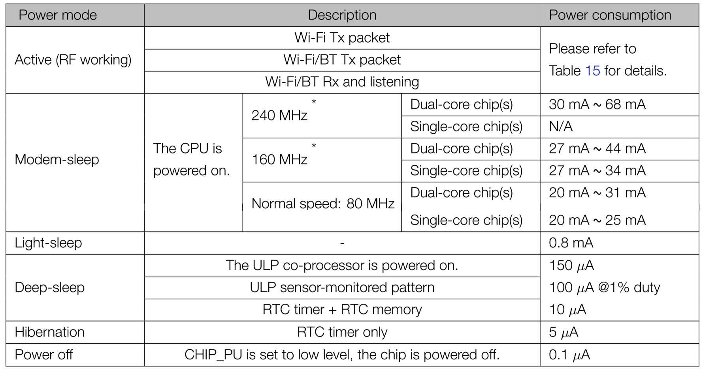
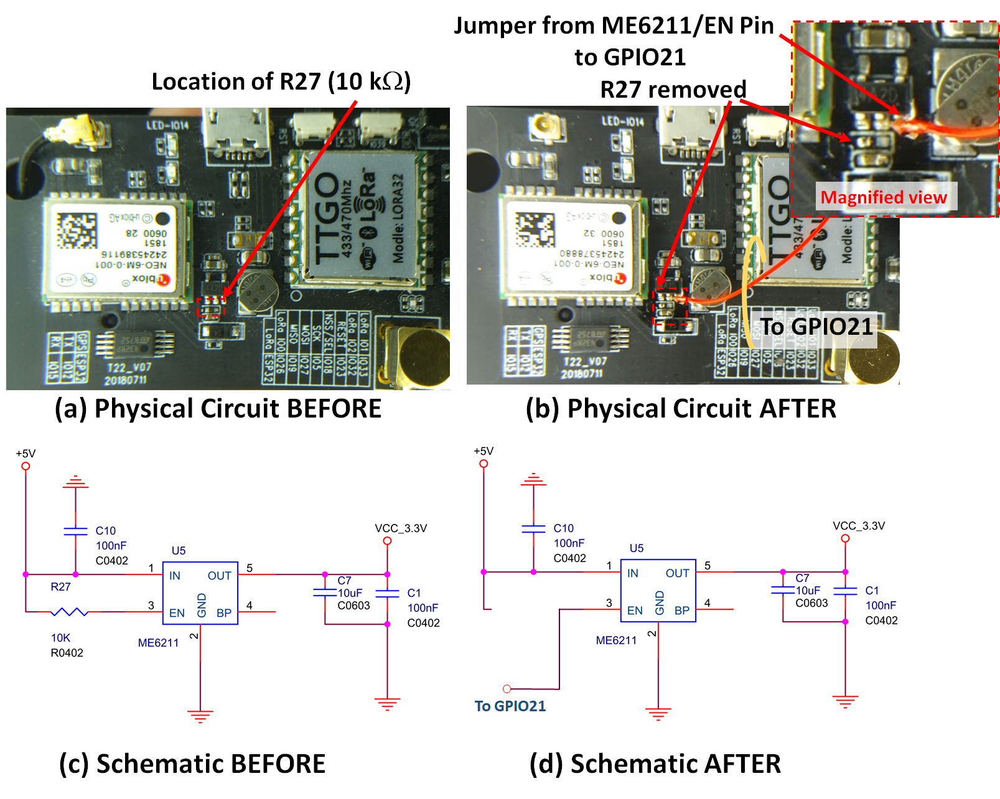
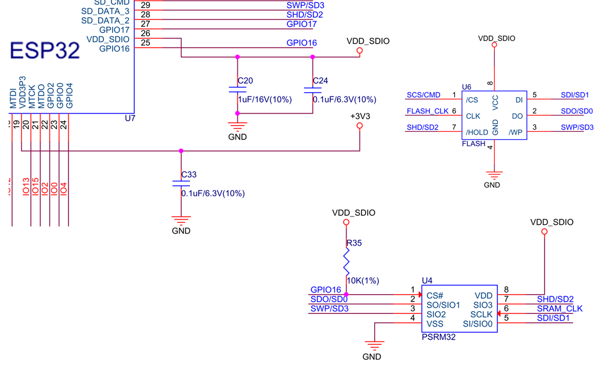

# TTGO Tbeam Ultra Low Power Modification

 This page describes 2 simple modifications which can significantly decrease the power consumption of the TTGO Tbeam boards based on the ESP32 both in normal opration and when in deep sleep.
 
 The TTGO is an xtremely versatile board allows WiFi, bluetooth, LorA radio, GPS and I/O under the conroll of an ESP32 processor.  The entire board is powered from a [18650 LiPo which nominally is rated at 2600 mA.hr](https://www.jaycar.com.au/18650-rechargeable-li-ion-battery-2600mah-3-7v/p/SB2308).  However during deep sleep the best that has been [reported is around 10+/-1mA](https://github.com/JoepSchyns/Low_power_TTGO_T-beam), so that the maximum operational time is just over 10 days before some form of recharging is required.  With the changes outlined here to significantly reduce the power of this board, this operatoinal time could be extended to over a year. 
 There are two modifications required to lower the power of the TTGO boards.  The first allows complete shiutdown of the [NEC 6 GPS](NEO-6_DataSheet_(GPS.G6-HW-09005).pdf), USB Controller and LoRa board during operation, so that only the ESP32 power concumption dominates.  the second allows shut down off the SPRAM and Flash atatched to the [ESP32](esp32_datasheet_en_ELEC_SPECS.pdf) so that during deep sleep, minimal power is consumed.  With these modifxation, a maximum of 170[20 &#181;A] is consumed during deep sleep, considerably less than the nominial 10mA reported elsewhere.
 
 Deep sleep modes are detailed in the [espressif page](https://docs.espressif.com/projects/esp-idf/en/latest/api-reference/system/sleep_modes.html) which describe how to shut down the eSP 32 into low power mode with all but the RTC operational.  The RTC needs to be active for the proecssor to wake on a timed interrupt.  The [ESP32 Electrical datasheet](esp32_datasheet_en_ELEC_SPECS.pdf) indicates the power consumption in the various modes as shown in the table below:
 
 

  <figcaption > <I><b>Table  1: </b></I>Extracted from the Espressif Systems ESP32 Datasheet V3.3 where it was originally designed "Table 6: Power Consumption by Power Modes" on page 21 of that document.

 
 
## Low power during operation (GPS/USB/LoRa Off)
The [ME6211](Nanjing-Micro-One-Elec-ME6211C33M5G-N_C82942.pdf) is a a High Speed LDO Regulator and the TTGO schematic includes 2 of these, one (U8) to generate a 3.3V that powers the ESP32 and atatched memeory and one (U5) that generate 3.3V (labeled VCC_3.3V) to power the GPS, USB I/O controller and LoRa board.  Both these ME6211 regulators contail an enable pin that is pulled high to keep the regulators on after power up.   Durings a regular boot sequence, the GPS is on and looks for satelites.  This typically draws 180+/-10 mA and lock can take around 2 minutes.  After lock the current consumption is still around 100mA.  While the GPS can be shut down in software, it is dificult to lower the current consumption much less than 90 mA during regular operation.  In this first approach is to connect the enable pin of IC U5 (the  ME6211 that generates  VCC_3.3V) to GPIO21 to allow the power to the GPS/LoRa/USB controller to be under software control.  This provides much greater flexibility when determining which devices should be powered up and when.

The physical layout of the TTGO Tbeam T22_V22 PCB is shonw in Figure 1a with the 10k&Omega; resistor R27 identified next to the ME6211. It is possible to undertake this modification without removing R27, however when the ME6211 enable pin is LOW, this causes an additional o remove this surface mount resistor I suggest using a small amount on regular Lead/Tin solder with a flux resin to allow even flow across the small component.  I performed this task with a regular electronics style soldering iron, but required a well lit magnifying lens durign the process.  After R27 is removed, a small piece of solid core [Kynar wire -nsometimes called wire-wrap wire](https://www.jaycar.com.au/red-wire-wrap-wire-on-spool/p/WW4344)was used to connect from ME6211 Pin 3 to GPIO21 on the header connector.  Once used, GPIO21 should not be used for another other task.  The PCB after R27 removal and the addition of the wire (red) is shown in Figure 1b.  The corresponding circuit before and after the PCB modification if shown in Figure 1c and 1d, respoectively.
The Physical layout of the TTGO Tbeam T22_V22 PCB showing (a) before and (b) after modifcation of the circuit to remove resistos R27 and add a jumpter from Pin 3 of ME6211 (

  <figcaption > <I><b>Figure 1: </b></I>

The results indicate:
1a) BEFORE   - OPERATION (GPS ON) 170	&plusmn;5 mA
1b) BEFORE   - SLEEP (GPS ON)     96	&plusmn;3 mA
1a) BEFORE   - OPERATION 70	&plusmn;2 mA
1b) BEFORE   - SLEEP     12.5	&plusmn;1 mA
2a) AFTER   - OPERATION 63	&plusmn;2 mA
3b) AFTER   - SLEEP     2.1	&plusmn;0.2 mA

with the <b>GPSFLAG = true</b> in the uploaded code <code> ARDUINO.INO</code> the bord draws significant current prior to removal of the R27 resistor.  Thsi drops considerably when <b>GPSFLAG = false</b> with the GPS being forced off.  However there is still considerable current drawn even in this state.
As can be seen, in the deep sleep mode, the current consumption has dropped to nominally 2.1mA after the removal of R27 and VSS_3.3V connection to GPIO21.  This result is an improvement of exiting approaches and indicates a substatial current draw from GPS/USB-Controller/LoRA occurs during the deep sleep of the ESP32 when these elements are stil powered.
## Ultra Low power during deep sleep (SPRAM and FLash Off)
During extensive software testing, no conditions could be found to lower the power below 2.1mA in deep sleep.  IT turns out the main schematics for the TTGO Tbeam is very similar to that used for the ESP32 XXXX](esp32-wroom-32_datasheet_en_with_SCHEMATICS.pdf) On checking the datasheet of the [ESP32 wroom-32](esp32_datasheet_en_ELEC SPECS.pdf) a generic Wi-Fi+BT+BLE MCU module.  From those schmatics, it appears that the external SPRAM and Flash could be shut down by powering both via VDD_3.3V which is a voltage generated through the ESP32 itself (it contains an internal LDO regulator).  However, on the (TTGO Tbeam)[https://github.com/LilyGO/TTGO-T-Beam] board the <b>VDD_SDIO is directly connected to 3.3V</b>.  Thsi 3.3V is the main battery supplied voltage, which is always on even during sleep.  As stated in [Section 2.3 Power Scheme of the ESP32 datasheet](esp32_datasheet_en_ELEC SPECS.pdf)  
<i> When VDD_SDIO is connected to the same PCB net together with VDD3P3_RTC, the internal LDO is disabled automatically. </i>  
Hence connecting VDD_SDIO is directly connected to 3.3V over-rides (bypasses) the internally generated VDD_SDIO, so that external SPRAM and Flash (and associated resistor R35, see (schematic)[t22_gps_v07.pdf]) (sourced from the [TTGO github](https://github.com/LilyGO/TTGO-T-Beam)) are all drawing current during deep sleep.  However this connection from VDD_SDIO to 3.3V is done through  R46 (a 0\Omega resistor) so I investigated removing the reisstor to determine the possible reduction in current during deep sleep. 

  <figcaption > <I><b>Figure 2: </b></I>

Using the same appraoch as described in Figure 1, a standard solderign iron with a small amoutn of tin/lead solder with a resin flux was used to remoce R46.  The physical layout of the board is shown in Figure 3a before and 3b after removing of the resistor.  In this image I have also added a small wire to VDD_SDIO to monitor what happens during deep sleep.  Sure enough , when the code enters a deep sleep using <code> esp_deep_sleep_start(); </code> the voltage VDD_SDIO drops to around 250mV, and jumps up to 3.2+/-0.1V when the board exits from sleep mode.  The relevance section of the circuit (schematic)[t22_gps_v07.pdf]) have been extracted and shown in Figure 3c and 3d, before and after the modification, respectively.

  <figcaption > <I><b>Figure 2: </b></I>

The results indicate: 

State | Operation Mode |  Measured Current
----- | ---------------| -----------------
1a) BEFORE | OPERATION |180+/-10mA
1b) BEFORE |  - SLEEP   |  12+/-1mA
2a) AFTER  | - OPERATION |56+/-1mA
3b) AFTER   |- SLEEP  |   170+/-20[20 &#181;A]

I note that when the entire power to the board is turned off vias S1 in the (schematic)[t22_gps_v07.pdf]), the current drawn is 70[20 &#181;A]
[20 &#181;A]

ter boardAs can be seen, in the deep sleep mode, the current consumption has dropped to nominally 2.5mA after the removal of R27 and VSS_3.3V connection to GPIO21.  Thsi result is better than any that I have seen to date and indicates a substatial current draw from GPS/USB-Controller/LoRA during the deep sleep of the ESP32.
